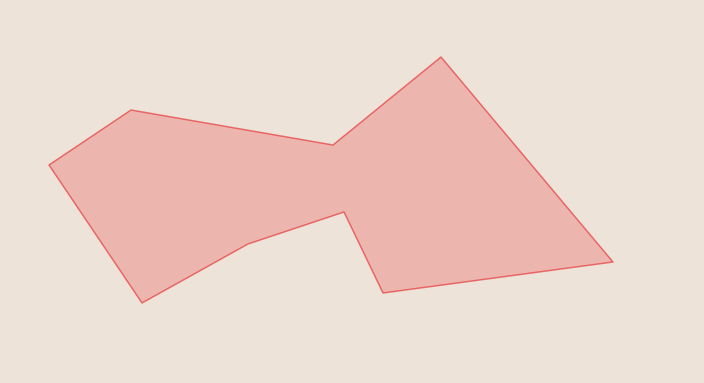
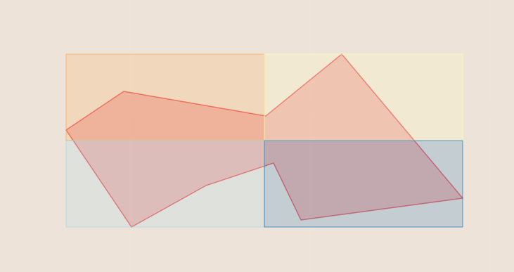
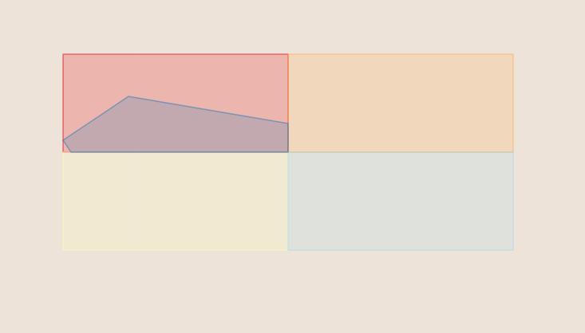
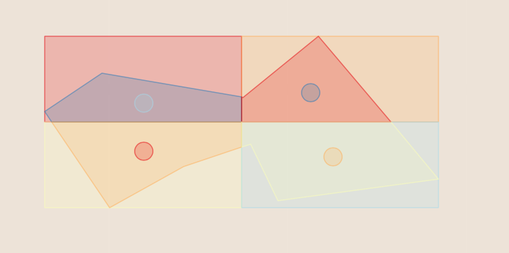

# 几何

## 创建点

```python
from osgeo import ogr
point = ogr.Geometry(ogr.wkbPoint)
point.AddPoint(1198054.34, 648493.09)
print(point.ExportToWkt())
```

## 创建线

```python
from osgeo import ogr
line = ogr.Geometry(ogr.wkbLineString)
line.AddPoint(1116651.439379124, 637392.6969887456)
line.AddPoint(1188804.0108498496, 652655.7409537067)
line.AddPoint(1226730.3625203592, 634155.0816022386)
line.AddPoint(1281307.30760719, 636467.6640211721)
print(line.ExportToWkt())
```

## 创建多边形

```python
from osgeo import ogr

# 创建环
ring = ogr.Geometry(ogr.wkbLinearRing)
ring.AddPoint(1179091.1646903288, 712782.8838459781)
ring.AddPoint(1161053.0218226474, 667456.2684348812)
ring.AddPoint(1214704.933941905, 641092.8288590391)
ring.AddPoint(1228580.428455506, 682719.3123998424)
ring.AddPoint(1218405.0658121984, 721108.1805541387)
ring.AddPoint(1179091.1646903288, 712782.8838459781)

# 创建多边形
poly = ogr.Geometry(ogr.wkbPolygon)
poly.AddGeometry(ring)

print(poly.ExportToWkt())
```

## 创建带洞的多边形

```python
from osgeo import ogr

# 创建内环
outRing = ogr.Geometry(ogr.wkbLinearRing)
outRing.AddPoint(1154115.274565847, 686419.4442701361)
outRing.AddPoint(1154115.274565847, 653118.2574374934)
outRing.AddPoint(1165678.1866605144, 653118.2574374934)
outRing.AddPoint(1165678.1866605144, 686419.4442701361)
outRing.AddPoint(1154115.274565847, 686419.4442701361)

# 创建外环
innerRing = ogr.Geometry(ogr.wkbLinearRing)
innerRing.AddPoint(1149490.1097279799, 691044.6091080031)
innerRing.AddPoint(1149490.1097279799, 648030.5761158396)
innerRing.AddPoint(1191579.1097525698, 648030.5761158396)
innerRing.AddPoint(1191579.1097525698, 691044.6091080031)
innerRing.AddPoint(1149490.1097279799, 691044.6091080031)

# 创建多边形
poly = ogr.Geometry(ogr.wkbPolygon)
poly.AddGeometry(outRing)
poly.AddGeometry(innerRing)

print(poly.ExportToWkt())
```

## 创建多部件点

```python
from osgeo import ogr

multipoint = ogr.Geometry(ogr.wkbMultiPoint)

point1 = ogr.Geometry(ogr.wkbPoint)
point1.AddPoint(1251243.7361610543, 598078.7958668759)
multipoint.AddGeometry(point1)

point2 = ogr.Geometry(ogr.wkbPoint)
point2.AddPoint(1240605.8570339603, 601778.9277371694)
multipoint.AddGeometry(point2)

point3 = ogr.Geometry(ogr.wkbPoint)
point3.AddPoint(1250318.7031934808, 606404.0925750365)
multipoint.AddGeometry(point3)

print(multipoint.ExportToWkt())
```

## 创建多部件线

```python
from osgeo import ogr

multiline = ogr.Geometry(ogr.wkbMultiLineString)

line1 = ogr.Geometry(ogr.wkbLineString)
line1.AddPoint(1214242.4174581182, 617041.9717021306)
line1.AddPoint(1234593.142744733, 629529.9167643716)
multiline.AddGeometry(line1)

line1 = ogr.Geometry(ogr.wkbLineString)
line1.AddPoint(1184641.3624957693, 626754.8178616514)
line1.AddPoint(1219792.6152635587, 606866.6090588232)
multiline.AddGeometry(line1)

print(multiline.ExportToWkt())
```

## 创建多部件多边形

```python
from osgeo import ogr

multipolygon = ogr.Geometry(ogr.wkbMultiPolygon)

# 创建环 #1
ring1 = ogr.Geometry(ogr.wkbLinearRing)
ring1.AddPoint(1204067.0548148106, 634617.5980860253)
ring1.AddPoint(1204067.0548148106, 620742.1035724243)
ring1.AddPoint(1215167.4504256917, 620742.1035724243)
ring1.AddPoint(1215167.4504256917, 634617.5980860253)
ring1.AddPoint(1204067.0548148106, 634617.5980860253)

# 创建多边形 #1
poly1 = ogr.Geometry(ogr.wkbPolygon)
poly1.AddGeometry(ring1)
multipolygon.AddGeometry(poly1)

# 创建环 #2
ring2 = ogr.Geometry(ogr.wkbLinearRing)
ring2.AddPoint(1179553.6811741155, 647105.5431482664)
ring2.AddPoint(1179553.6811741155, 626292.3013778647)
ring2.AddPoint(1194354.20865529, 626292.3013778647)
ring2.AddPoint(1194354.20865529, 647105.5431482664)
ring2.AddPoint(1179553.6811741155, 647105.5431482664)

# 创建多边形 #2
poly2 = ogr.Geometry(ogr.wkbPolygon)
poly2.AddGeometry(ring2)
multipolygon.AddGeometry(poly2)

print(multipolygon.ExportToWkt())
```

## 创建几何集合

```python
from osgeo import ogr

# 创建几何集合
geomcol =  ogr.Geometry(ogr.wkbGeometryCollection)

# 添加点
point = ogr.Geometry(ogr.wkbPoint)
point.AddPoint(-122.23, 47.09)
geomcol.AddGeometry(point)

# 添加线
line = ogr.Geometry(ogr.wkbLineString)
line.AddPoint(-122.60, 47.14)
line.AddPoint(-122.48, 47.23)
geomcol.AddGeometry(line)

print(geomcol.ExportToWkt())
```

## 从WKT创建几何

```python
from osgeo import ogr

wkt = "POINT (1120351.5712494177 741921.4223245403)"
point = ogr.CreateGeometryFromWkt(wkt)
print("%d,%d" % (point.GetX(), point.GetY()))
```

## 从GeoJSON创建几何

```python
from osgeo import ogr

geojson = """{"type":"Point","coordinates":[108420.33,753808.59]}"""
point = ogr.CreateGeometryFromJson(geojson)
print("%d,%d" % (point.GetX(), point.GetY()))
```

## 从GML创建几何

```python
from osgeo import ogr

gml = """<gml:Point xmlns:gml="http://www.opengis.net/gml"><gml:coordinates>108420.33,753808.59</gml:coordinates></gml:Point>"""
point = ogr.CreateGeometryFromGML(gml)
print("%d,%d" % (point.GetX(), point.GetY()))
```

## 从WKB创建几何

```python
from osgeo import ogr
from base64 import b64decode

wkb = b64decode("AIAAAAFBMkfmVwo9cUEjylouFHrhAAAAAAAAAAA=")
point = ogr.CreateGeometryFromWkb(wkb)
print("%d,%d" % (point.GetX(), point.GetY()))
```

## 计算点的个数

```python
from osgeo import ogr

wkt = "LINESTRING (1181866.263593049 615654.4222507705, 1205917.1207499576 623979.7189589312, 1227192.8790041457 643405.4112779726, 1224880.2965852122 665143.6860159477)"
geom = ogr.CreateGeometryFromWkt(wkt)
print("Geometry has %i points" % (geom.GetPointCount()))
```

## 计算几何个数

```python
from osgeo import ogr

wkt = "MULTIPOINT (1181866.263593049 615654.4222507705, 1205917.1207499576 623979.7189589312, 1227192.8790041457 643405.4112779726, 1224880.2965852122 665143.6860159477)"
geom = ogr.CreateGeometryFromWkt(wkt)
print("Geometry has %i geometries" % (geom.GetGeometryCount()))
```

## 迭代几何

```python
from osgeo import ogr

wkt = "MULTIPOINT (1181866.263593049 615654.4222507705, 1205917.1207499576 623979.7189589312, 1227192.8790041457 643405.4112779726, 1224880.2965852122 665143.6860159477)"
geom = ogr.CreateGeometryFromWkt(wkt)
for i in range(0, geom.GetGeometryCount()):
    g = geom.GetGeometryRef(i)
    print("%i). %s" %(i, g.ExportToWkt()))
```

## 迭代点

```python
from osgeo import ogr

wkt = "LINESTRING (1181866.263593049 615654.4222507705, 1205917.1207499576 623979.7189589312, 1227192.8790041457 643405.4112779726, 1224880.2965852122 665143.6860159477)"
geom = ogr.CreateGeometryFromWkt(wkt)
for i in range(0, geom.GetPointCount()):
    # GetPoint 返回一个元俄日不是一个Geometry
    pt = geom.GetPoint(i)
    print("%i). POINT (%d %d)" %(i, pt[0], pt[1]))
```

## 几何缓冲区

```python
from osgeo import ogr

wkt = "POINT (1198054.34 648493.09)"
pt = ogr.CreateGeometryFromWkt(wkt)
bufferDistance = 500
poly = pt.Buffer(bufferDistance)
print("%s buffered by %d is %s" % (pt.ExportToWkt(), bufferDistance, poly.ExportToWkt()))
```

## 计算包围盒

```python
from osgeo import ogr

wkt = "LINESTRING (1181866.263593049 615654.4222507705, 1205917.1207499576 623979.7189589312, 1227192.8790041457 643405.4112779726, 1224880.2965852122 665143.6860159477)"
geom = ogr.CreateGeometryFromWkt(wkt)
# GetEnvelope 饭hi一个元组 (minX, maxX, minY, maxY)
env = geom.GetEnvelope()
print("minX: %d, minY: %d, maxX: %d, maxY: %d" %(env[0],env[2],env[1],env[3]))
```

## 计算面积

```python
from osgeo import ogr

wkt = "POLYGON ((1162440.5712740074 672081.4332727483, 1162440.5712740074 647105.5431482664, 1195279.2416228633 647105.5431482664, 1195279.2416228633 672081.4332727483, 1162440.5712740074 672081.4332727483))"
poly = ogr.CreateGeometryFromWkt(wkt)
print("Area = %d" % poly.GetArea())
```

## 计算长度

```python
from osgeo import ogr

wkt = "LINESTRING (1181866.263593049 615654.4222507705, 1205917.1207499576 623979.7189589312, 1227192.8790041457 643405.4112779726, 1224880.2965852122 665143.6860159477)"
geom = ogr.CreateGeometryFromWkt(wkt)
print("Length = %d" % geom.Length())
```

## 获得几何类型

```python
from osgeo import ogr

wkts = [
    "POINT (1198054.34 648493.09)",
    "LINESTRING (1181866.263593049 615654.4222507705, 1205917.1207499576 623979.7189589312, 1227192.8790041457 643405.4112779726, 1224880.2965852122 665143.6860159477)",
    "POLYGON ((1162440.5712740074 672081.4332727483, 1162440.5712740074 647105.5431482664, 1195279.2416228633 647105.5431482664, 1195279.2416228633 672081.4332727483, 1162440.5712740074 672081.4332727483))"
]

for wkt in wkts:
    geom = ogr.CreateGeometryFromWkt(wkt)
    print(geom.GetGeometryName())
```

## 计算几何相交

```python
from osgeo import ogr

wkt1 = "POLYGON ((1208064.271243039 624154.6783778917, 1208064.271243039 601260.9785661874, 1231345.9998651114 601260.9785661874, 1231345.9998651114 624154.6783778917, 1208064.271243039 624154.6783778917))"
wkt2 = "POLYGON ((1199915.6662253144 633079.3410163528, 1199915.6662253144 614453.958118695, 1219317.1067437078 614453.958118695, 1219317.1067437078 633079.3410163528, 1199915.6662253144 633079.3410163528)))"

poly1 = ogr.CreateGeometryFromWkt(wkt1)
poly2 = ogr.CreateGeometryFromWkt(wkt2)

intersection = poly1.Intersection(poly2)

print(intersection.ExportToWkt())
```

## 计算几何并集

```python
from osgeo import ogr

wkt1 = "POLYGON ((1208064.271243039 624154.6783778917, 1208064.271243039 601260.9785661874, 1231345.9998651114 601260.9785661874, 1231345.9998651114 624154.6783778917, 1208064.271243039 624154.6783778917))"
wkt2 = "POLYGON ((1199915.6662253144 633079.3410163528, 1199915.6662253144 614453.958118695, 1219317.1067437078 614453.958118695, 1219317.1067437078 633079.3410163528, 1199915.6662253144 633079.3410163528)))"

poly1 = ogr.CreateGeometryFromWkt(wkt1)
poly2 = ogr.CreateGeometryFromWkt(wkt2)

union = poly1.Union(poly2)

print(poly1)
print(poly2)
print(union.ExportToWkt())
```

## 输出几何到GeoJSON

有两个选项可从几何图形创建GeoJSON。

你可以创建一个新的GeoJSON文件，也可以直接将几何图形导出到Json并进行打印，这两个选项将在下面说明。

```python
from osgeo import ogr

# 创建测试多边形
ring = ogr.Geometry(ogr.wkbLinearRing)
ring.AddPoint(1179091.1646903288, 712782.8838459781)
ring.AddPoint(1161053.0218226474, 667456.2684348812)
ring.AddPoint(1214704.933941905, 641092.8288590391)
ring.AddPoint(1228580.428455506, 682719.3123998424)
ring.AddPoint(1218405.0658121984, 721108.1805541387)
ring.AddPoint(1179091.1646903288, 712782.8838459781)
poly = ogr.Geometry(ogr.wkbPolygon)
poly.AddGeometry(ring)

# 创建输出驱动
outDriver = ogr.GetDriverByName('GeoJSON')

# 创建输出GeoJSON
outDataSource = outDriver.CreateDataSource('test.geojson')
outLayer = outDataSource.CreateLayer('test.geojson', geom_type=ogr.wkbPolygon )

# 创建要素定义
featureDefn = outLayer.GetLayerDefn()

# 创建新要素
outFeature = ogr.Feature(featureDefn)

# 设置新几何
outFeature.SetGeometry(poly)

# 添加要素到图层
outLayer.CreateFeature(outFeature)

# 释放要素
outFeature = None

# 保存关闭数据源
outDataSource = None
```

```python
from osgeo import ogr

# 创建测试多边形
ring = ogr.Geometry(ogr.wkbLinearRing)
ring.AddPoint(1179091.1646903288, 712782.8838459781)
ring.AddPoint(1161053.0218226474, 667456.2684348812)
ring.AddPoint(1214704.933941905, 641092.8288590391)
ring.AddPoint(1228580.428455506, 682719.3123998424)
ring.AddPoint(1218405.0658121984, 721108.1805541387)
ring.AddPoint(1179091.1646903288, 712782.8838459781)
poly = ogr.Geometry(ogr.wkbPolygon)
poly.AddGeometry(ring)

geojson = poly.ExportToJson()
print(geojson)
```

## 输出几何到WKT

```python
from osgeo import ogr

# 创建测试几何
ring = ogr.Geometry(ogr.wkbLinearRing)
ring.AddPoint(1179091.1646903288, 712782.8838459781)
ring.AddPoint(1161053.0218226474, 667456.2684348812)
ring.AddPoint(1214704.933941905, 641092.8288590391)
ring.AddPoint(1228580.428455506, 682719.3123998424)
ring.AddPoint(1218405.0658121984, 721108.1805541387)
ring.AddPoint(1179091.1646903288, 712782.8838459781)
geom_poly = ogr.Geometry(ogr.wkbPolygon)
geom_poly.AddGeometry(ring)

# 输出几何到WKT
wkt = geom_poly.ExportToWkt()
print(wkt)
```

## 输出几何到KML

```python
from osgeo import ogr

# 创建测试几何
ring = ogr.Geometry(ogr.wkbLinearRing)
ring.AddPoint(1179091.1646903288, 712782.8838459781)
ring.AddPoint(1161053.0218226474, 667456.2684348812)
ring.AddPoint(1214704.933941905, 641092.8288590391)
ring.AddPoint(1228580.428455506, 682719.3123998424)
ring.AddPoint(1218405.0658121984, 721108.1805541387)
ring.AddPoint(1179091.1646903288, 712782.8838459781)
geom_poly = ogr.Geometry(ogr.wkbPolygon)
geom_poly.AddGeometry(ring)

kml = geom_poly.ExportToKML()
print(kml)
```

## 输出几何到WKB

```python
from osgeo import ogr

# 创建测试几何
ring = ogr.Geometry(ogr.wkbLinearRing)
ring.AddPoint(1179091.1646903288, 712782.8838459781)
ring.AddPoint(1161053.0218226474, 667456.2684348812)
ring.AddPoint(1214704.933941905, 641092.8288590391)
ring.AddPoint(1228580.428455506, 682719.3123998424)
ring.AddPoint(1218405.0658121984, 721108.1805541387)
ring.AddPoint(1179091.1646903288, 712782.8838459781)
geom_poly = ogr.Geometry(ogr.wkbPolygon)
geom_poly.AddGeometry(ring)

# 输出几何到WKB
wkb = geom_poly.ExportToWkb()
print(wkb)
```

## 强制多边形到多部件多边形

```python
from osgeo import ogr

# 创建测试几何
poly_wkt= "POLYGON ((1179091.164690328761935 712782.883845978067257,1161053.021822647424415 667456.268434881232679,1214704.933941904921085 641092.828859039116651,1228580.428455505985767 682719.312399842427112,1218405.065812198445201 721108.180554138729349,1179091.164690328761935 712782.883845978067257))"
geom_poly = ogr.CreateGeometryFromWkt(poly_wkt)

# 强制多边形到多部件多边形
if geom_poly.GetGeometryType() == ogr.wkbPolygon:
   geom_poly = ogr.ForceToMultiPolygon(geom_poly)
   # 如果迭代要素只是为了更新几何(geometry)，可以使用feature.SetGeometryDirectly(geom_poly)

# 输出几何到WKT
wkt = geom_poly.ExportToWkt()
print(wkt)
```

## 四等分多边形并创建质心

```python
from osgeo import ogr

# 创建多边形
poly_Wkt= "POLYGON((-107.42631019589980212 40.11971708125970082,-107.42455436683293613 40.12061219666851741,-107.42020981542387403 40.12004414402532859,-107.41789122063043749 40.12149008687303819,-107.41419947746419439 40.11811617239460048,-107.41915181585792993 40.11761695654455906,-107.41998470913324581 40.11894245264452508,-107.42203317637793702 40.1184088144647788,-107.42430674991324224 40.1174448122981957,-107.42430674991324224 40.1174448122981957,-107.42631019589980212 40.11971708125970082))"
geom_poly = ogr.CreateGeometryFromWkt(poly_Wkt)
```



```python
# Create 4 square polygons
geom_poly_envelope = geom_poly.GetEnvelope()
minX = geom_poly_envelope[0]
minY = geom_poly_envelope[2]
maxX = geom_poly_envelope[1]
maxY = geom_poly_envelope[3]

'''
coord0----coord1----coord2
|           |           |
coord3----coord4----coord5
|           |           |
coord6----coord7----coord8
'''
coord0 = minX, maxY
coord1 = minX+(maxX-minX)/2, maxY
coord2 = maxX, maxY
coord3 = minX, minY+(maxY-minY)/2
coord4 = minX+(maxX-minX)/2, minY+(maxY-minY)/2
coord5 = maxX, minY+(maxY-minY)/2
coord6 = minX, minY
coord7 = minX+(maxX-minX)/2, minY
coord8 = maxX, minY

ringTopLeft = ogr.Geometry(ogr.wkbLinearRing)
ringTopLeft.AddPoint_2D(*coord0)
ringTopLeft.AddPoint_2D(*coord1)
ringTopLeft.AddPoint_2D(*coord4)
ringTopLeft.AddPoint_2D(*coord3)
ringTopLeft.AddPoint_2D(*coord0)
polyTopLeft = ogr.Geometry(ogr.wkbPolygon)
polyTopLeft.AddGeometry(ringTopLeft)


ringTopRight = ogr.Geometry(ogr.wkbLinearRing)
ringTopRight.AddPoint_2D(*coord1)
ringTopRight.AddPoint_2D(*coord2)
ringTopRight.AddPoint_2D(*coord5)
ringTopRight.AddPoint_2D(*coord4)
ringTopRight.AddPoint_2D(*coord1)
polyTopRight = ogr.Geometry(ogr.wkbPolygon)
polyTopRight.AddGeometry(ringTopRight)


ringBottomLeft = ogr.Geometry(ogr.wkbLinearRing)
ringBottomLeft.AddPoint_2D(*coord3)
ringBottomLeft.AddPoint_2D(*coord4)
ringBottomLeft.AddPoint_2D(*coord7)
ringBottomLeft.AddPoint_2D(*coord6)
ringBottomLeft.AddPoint_2D(*coord3)
polyBottomLeft = ogr.Geometry(ogr.wkbPolygon)
polyBottomLeft.AddGeometry(ringBottomLeft)


ringBottomRight = ogr.Geometry(ogr.wkbLinearRing)
ringBottomRight.AddPoint_2D(*coord4)
ringBottomRight.AddPoint_2D(*coord5)
ringBottomRight.AddPoint_2D(*coord8)
ringBottomRight.AddPoint_2D(*coord7)
ringBottomRight.AddPoint_2D(*coord4)
polyBottomRight = ogr.Geometry(ogr.wkbPolygon)
polyBottomRight.AddGeometry(ringBottomRight)
```



```python
# 对四个方格多边形求交
quaterPolyTopLeft = polyTopLeft.Intersection(geom_poly)
quaterPolyTopRight =  polyTopRight.Intersection(geom_poly)
quaterPolyBottomLeft =  polyBottomLeft.Intersection(geom_poly)
quaterPolyBottomRight =  polyBottomRight.Intersection(geom_poly)
```



```python
# 创建质心
centroidTopLeft = quaterPolyTopLeft.Centroid()
centroidTopRight =  quaterPolyTopRight.Centroid()
centroidBottomLeft =  quaterPolyBottomLeft.Centroid()
centroidBottomRight =  quaterPolyBottomRight.Centroid()
```

